# LocalLibrary

Home Page

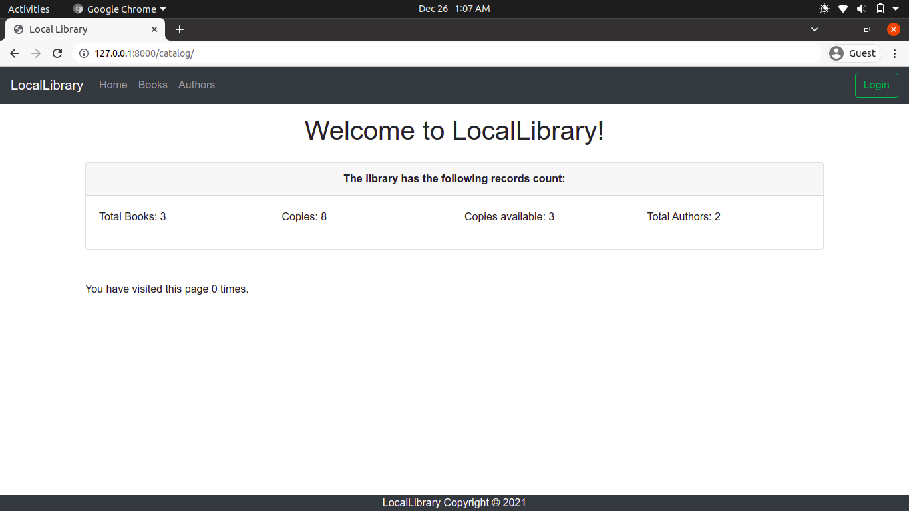

---

Login

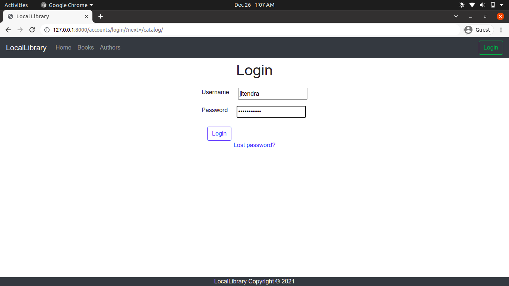

---

Admin Panel

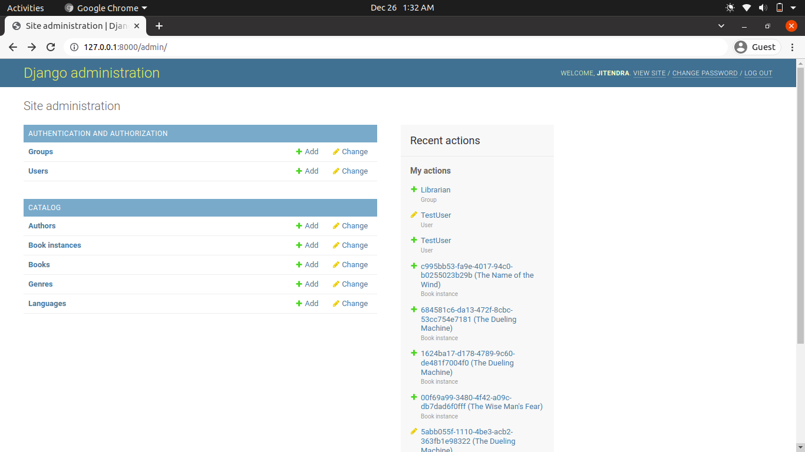

---

Librarian Panel

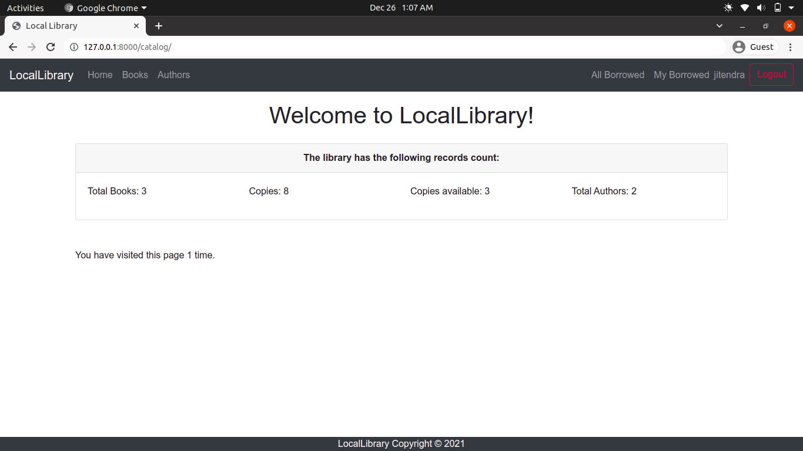

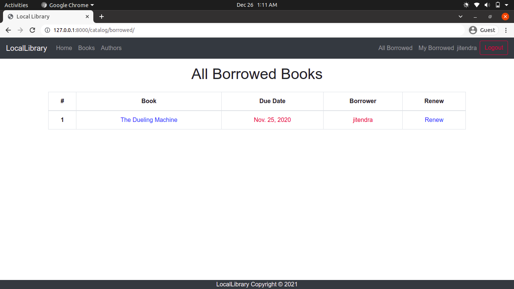

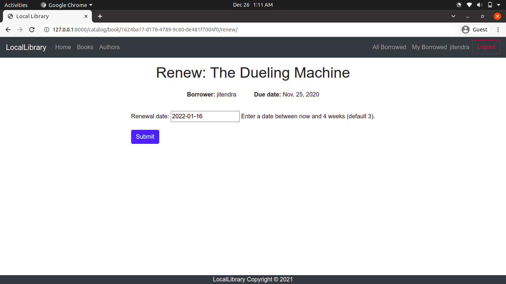

---

Student Panel

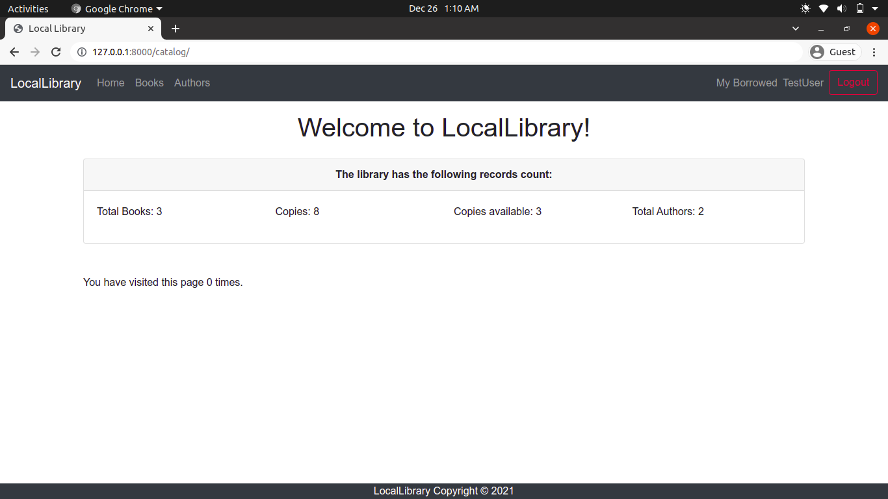

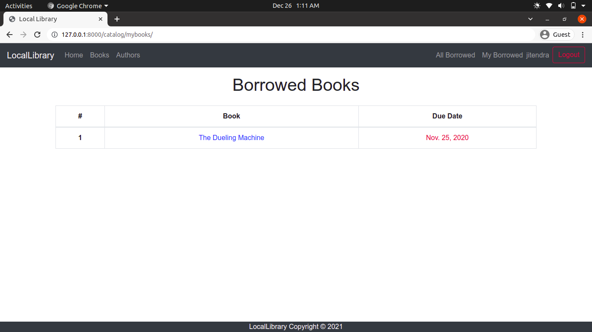

---

ListView of Books and Authors

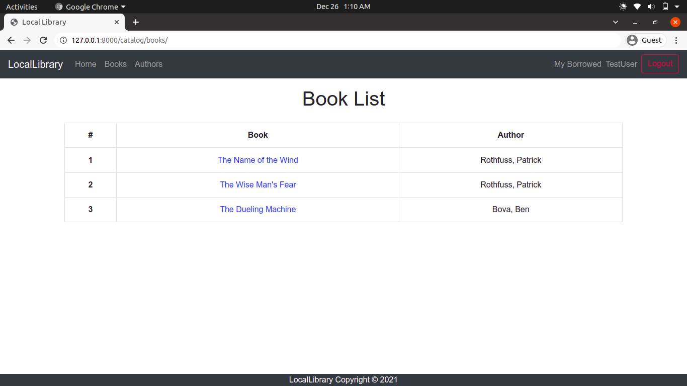

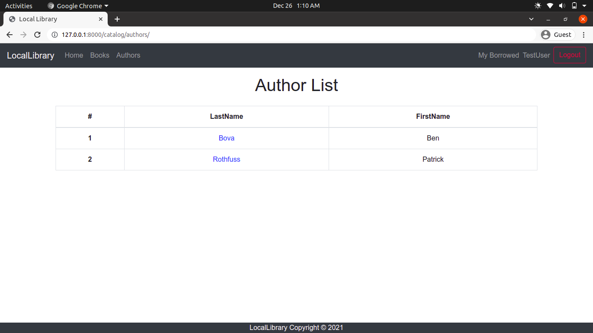

---

CRUD: Books

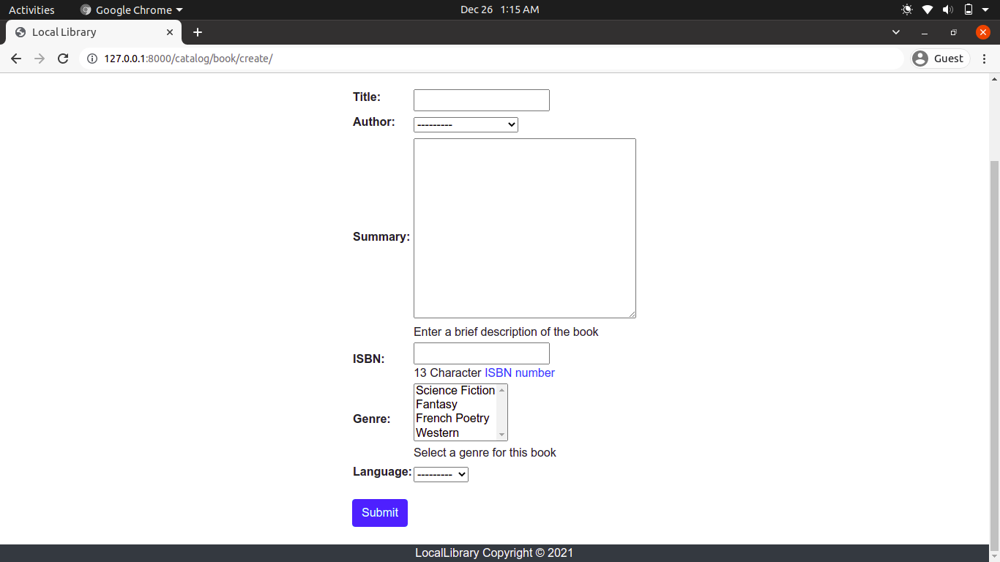

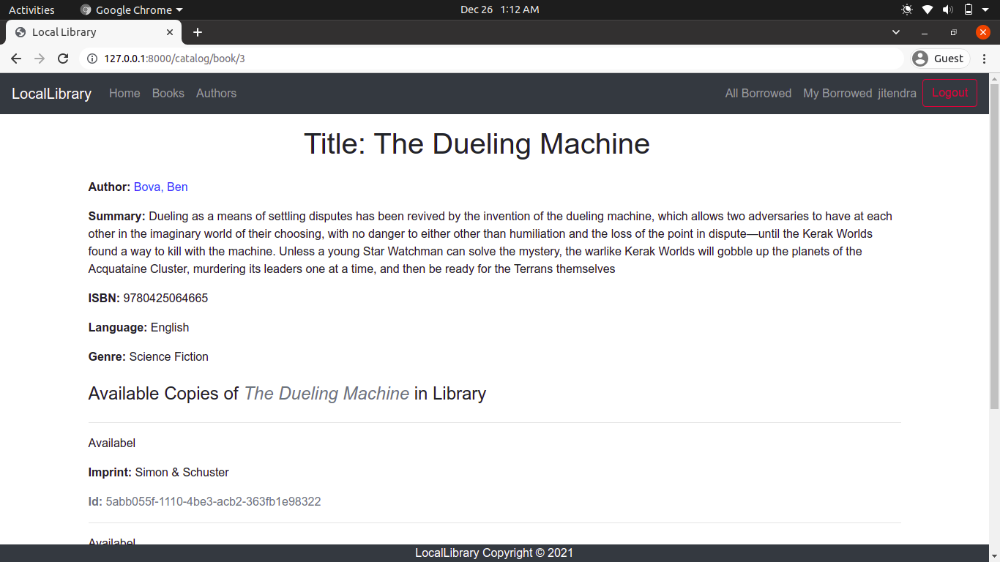

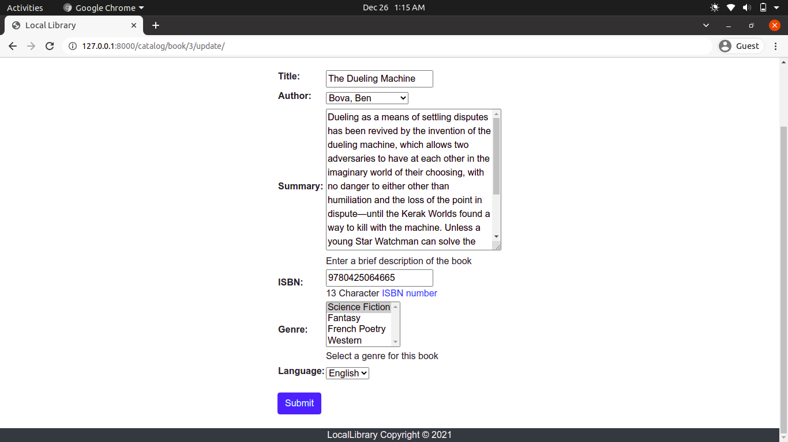

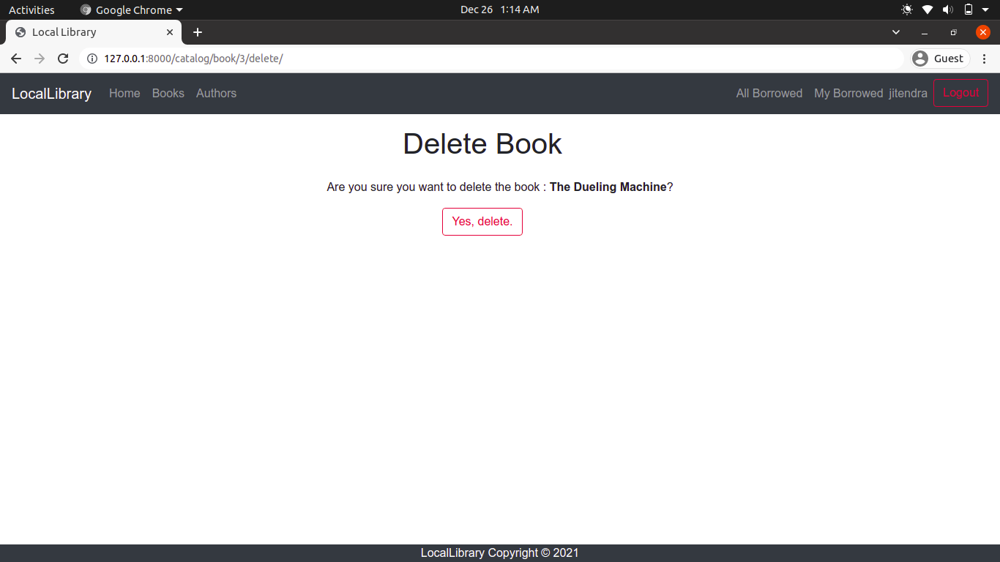

---

CRUD: Authors

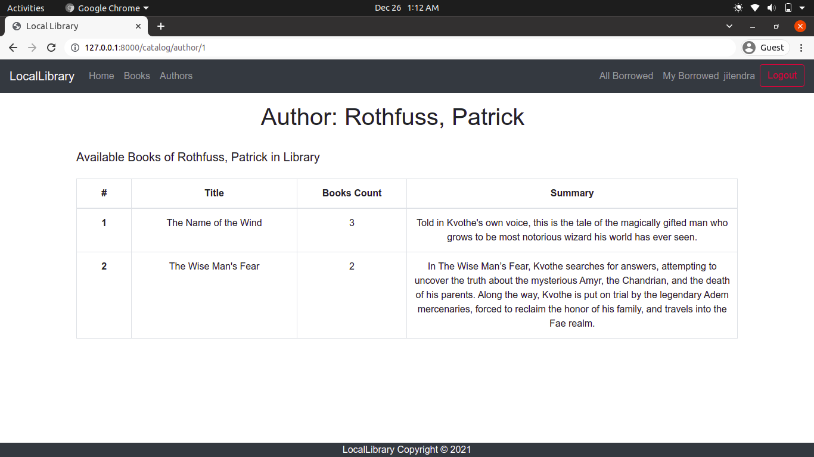

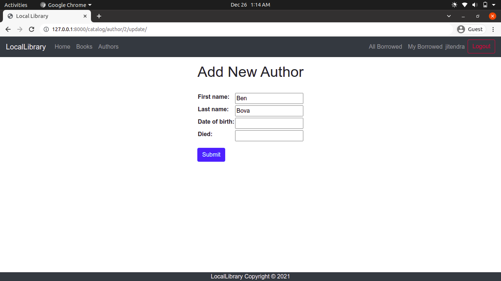

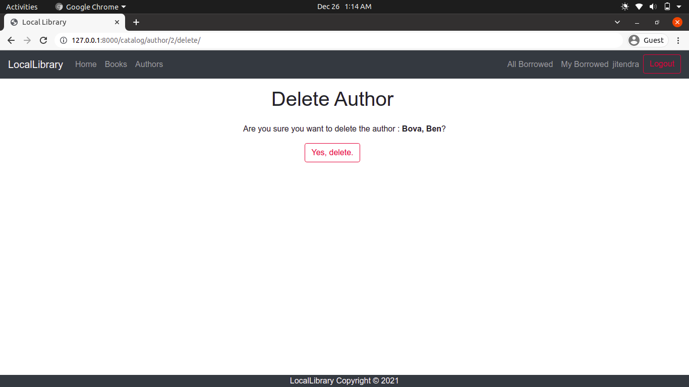

---
